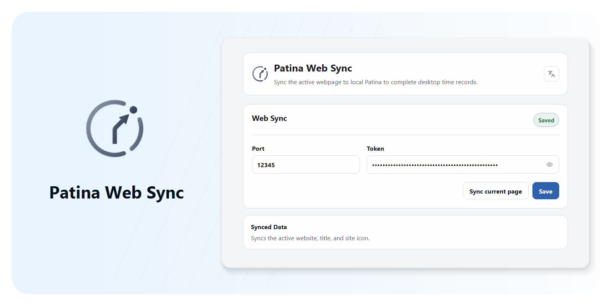

<div align="center">

# Patina Web Sync

Local webpage activity sync extension for Patina.

English · [简体中文](README.zh-CN.md)


[](LICENSE)

</div>

<p align="center">
Patina Web Sync identifies the current browser page so Patina can complete local, quiet, trustworthy desktop time records.
</p>

<p align="center">
  <picture>
    <source media="(prefers-color-scheme: dark)" srcset=".github/assets/readme/hero-dark.png">
    <source media="(prefers-color-scheme: light)" srcset=".github/assets/readme/hero-light.png">
    
  </picture>
</p>

## Why Patina Web Sync

Patina can automatically record foreground apps, but browser activity usually appears only as Chrome, Edge, or Firefox. Patina Web Sync adds the current page URL, title, and site icon so browser time records do not stop at "using a browser."

- Identifies the active webpage and syncs its URL, title, and site icon information to local Patina.
- Pairs with the local port and token shown in Patina Settings, without an account.
- Connects only to `127.0.0.1` or `localhost`, not to a cloud service.
- Shows connection and sync status in the extension popup and options page.
- Skips Incognito/private/InPrivate tabs before sending.
- Keeps the extension UI lightweight and limited to the browser companion role.

## Installation

Patina Web Sync is designed to work with the Patina desktop app. Install and open Patina first.

Browser-store releases are still being prepared. Before store listing, use GitHub Releases or local installation:

- Chromium / Chrome / Edge: download the Chromium extension zip, extract it, then load the extracted directory from the browser extension management page.
- Firefox: use the AMO-signed `.xpi` from GitHub Releases and install it from the Firefox Add-ons Manager.

## Connect To Patina

1. Open Patina.
2. Enable Web Sync in Patina Settings.
3. Copy the local port and token shown by Patina.
4. Open the Patina Web Sync extension options page.
5. Enter the port and token, then save.
6. Open a normal `http` or `https` webpage.
7. Open the extension popup and confirm the current page has synced to Patina.

If Patina Web Sync is disabled in Patina, the token is incorrect, or the local port is unavailable, the extension shows an unsynced state.

## Core Capabilities

### Active Webpage Sync

- Syncs the current active tab's website URL, title, and site icon information.
- Records browser kind, extension version, tab/window id, capture time, and sync reason.
- Syncs only normal `http` / `https` pages; browser internal pages are not synced as webpage activity.

### Local Pairing

- Uses the local port and bearer token generated by Patina Settings.
- Sends requests only to `127.0.0.1` or `localhost`.
- Stores only connection settings and recent sync status in the extension; webpage activity records are stored by the Patina desktop app.

### Private Browsing Protection

- Incognito/private/InPrivate tabs are skipped in the extension before sending.
- When skipped, the extension does not send that tab's webpage URL, title, or site icon information to Patina.
- The Patina receiver still keeps backup filtering logic for old extensions or abnormal local clients.

### Browser Targets

- The Chromium-family target supports Chrome, Edge, and other Manifest V3 browsers, and uses the browser's local favicon cache.
- The Firefox target keeps its own manifest and stable Gecko id, and does not request the Chromium-only `favicon` permission.

## Reliability And Privacy

Patina Web Sync has a narrow boundary: it only performs browser-side local webpage activity sync.

- **Local communication**: the extension sends requests only to local Patina.
- **Minimal data**: it syncs the URL, title, site icon information, and small sync metadata needed for non-private active tabs.
- **No page collection**: it does not read page body content, form values, passwords, screenshots, clipboard contents, cookies, download history, or the browser history database.
- **No remote service**: it does not provide accounts, cloud sync, team workspace, analytics, or remote collection.
- **Explicit success condition**: the extension shows a sync as successful only when local Patina returns a successful response.

See [PRIVACY.md](./PRIVACY.md) for the full privacy policy.

## Current Scope

Patina Web Sync currently focuses on Patina's browser companion sync:

- Chromium-family browser extension target
- Firefox-family browser extension target
- Local Patina Web Sync pairing and sync
- Chrome Web Store, Firefox AMO, and Microsoft Edge Add-ons listing preparation

It does not own the Patina desktop runtime, SQLite storage, backup/restore, History, Data, Settings, or Classification read models. Those capabilities are maintained in the Patina main repository.

## Run From Source

### Requirements

- [Node.js](https://nodejs.org/) 18+

### Install Dependencies

```bash
git clone https://github.com/Ceceliaee/patina-web-sync.git
cd patina-web-sync
npm install
```

### Local Check

```bash
npm run check
```

### Build Unpacked Extensions

```bash
npm run extension:chromium:build
npm run extension:firefox:build
```

### Create Local Packages

```bash
npm run extension:chromium:package
npm run extension:firefox:package
```

The Chromium package is generated under:

```text
dist/extensions/chromium/
```

The Firefox package is generated under:

```text
dist/extensions/firefox/
```

## Feedback

If you run into an issue or notice abnormal webpage sync behavior, use GitHub Issues:

- <https://github.com/Ceceliaee/patina-web-sync/issues>

## License

[MIT](LICENSE)
