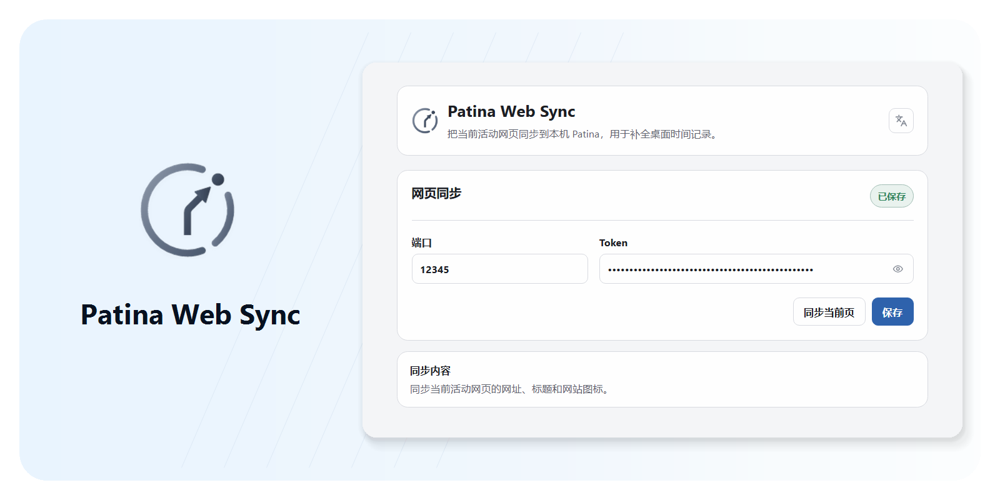

<div align="center">

# Patina Web Sync

Patina 的本地网页活动同步扩展。

[English](README.md) · 简体中文


[](LICENSE)

</div>

<p align="center">
将当前网页发送给本机 Patina，用于补全桌面时间记录。
</p>

<p align="center">
  <picture>
    <source media="(prefers-color-scheme: dark)" srcset=".github/assets/readme.zh-CN/hero-dark.png">
    <source media="(prefers-color-scheme: light)" srcset=".github/assets/readme.zh-CN/hero-light.png">
    
  </picture>
</p>

## 为什么需要 Patina Web Sync

Patina 可以自动记录前台应用，但浏览器通常只会显示为 Chrome、Edge 或 Firefox。Patina Web Sync 会补充当前页面的完整 URL、页面标题和网站图标，让浏览器时间记录不只停留在“正在使用浏览器”。

- 识别当前活动网页，把完整 URL、标题和网站图标信息同步给本机 Patina，使完整 URL 可以进入数据导出。
- 使用 Patina Settings 里的本机端口和 token 配对，不需要账号。
- 只连接 `127.0.0.1` 或 `localhost`，不连接云端服务。
- 在扩展弹出窗口和设置页里显示当前连接与同步状态。
- 在发送前跳过 Incognito/private/InPrivate 标签页。
- 保持扩展界面轻量，只承担浏览器侧伴生任务。

## 安装

Patina Web Sync 需要和 Patina 桌面应用配合使用。请先安装并打开 Patina。

浏览器商店版本仍在准备中。商店上架前，以 GitHub Releases 和本地安装为准：

- Chromium / Chrome / Edge：下载 Chromium 扩展 zip，解压后在浏览器扩展管理页加载解压目录。
- Firefox：使用 GitHub Release 中经 AMO 签名的 `.xpi`，通过 Firefox 附加组件管理器从文件安装。

## 连接 Patina

1. 打开 Patina。
2. 在 Patina Settings 中启用 Web Sync。
3. 复制 Patina 显示的本机端口和 token。
4. 打开 Patina Web Sync 的扩展设置页。
5. 填入端口和 token，保存设置。
6. 打开一个普通 `http` 或 `https` 网页。
7. 打开扩展弹出窗口，确认当前网页已同步到 Patina。

如果 Patina 未开启 Web Sync、token 不正确，或本机端口不可用，扩展会显示未同步状态。

## 核心能力

### 活动网页同步

- 同步当前活动标签页的完整 URL、标题和网站图标信息。
- Chromium 会发送本机浏览器客户端标识、浏览器类型和扩展版本，用于兼容与诊断；Firefox 仅在用户允许可选技术数据后发送这些字段。
- 只同步普通 `http` / `https` 页面；浏览器内部页面不会作为网页活动同步。

### 本机配对

- 使用 Patina Settings 生成的本机端口和 bearer token。
- 请求只发送到 `127.0.0.1` 或 `localhost`。
- 扩展只保存连接设置和最近同步状态，网页活动记录由 Patina 桌面应用保存。

### 私密浏览保护

- Incognito/private/InPrivate 标签页会在扩展端发送前被跳过。
- 跳过时不会向 Patina 发送该标签页的网页地址、标题或网站图标信息。
- Patina 接收端仍保留后备过滤逻辑，以兼容旧扩展或异常本机客户端。

### 跨浏览器目标

- Chromium 系目标支持 Chrome、Edge 等 Manifest V3 浏览器，并使用浏览器本地 favicon cache。
- Firefox 目标要求 Firefox 142 或以上版本，保留稳定 Gecko id，使用内置数据同意，且不请求 Chromium-only 的 `favicon` permission。

## 可靠性与隐私

Patina Web Sync 的边界很窄：它只做浏览器侧的本机网页活动信息同步。

- **本机通信**：扩展只向本机 Patina 发送请求。
- **用途限定数据**：同步非私密活动标签页及完整 URL 导出所需的完整 URL、标题、网站图标信息和最少的本机兼容元数据。
- **没有页面采集**：不读取网页正文、表单内容、密码、截图、剪贴板、cookies、下载历史或浏览器历史数据库。
- **没有远程服务**：不提供账号、云同步、团队空间、analytics 或远程采集。
- **成功条件明确**：只有本机 Patina 返回成功响应时，扩展才会显示为已同步。

完整隐私说明见 [PRIVACY.md](./PRIVACY.md)。

## 当前范围

Patina Web Sync 当前专注于 Patina 的浏览器伴生同步：

- Chromium 系浏览器扩展目标
- Firefox 系浏览器扩展目标
- 本机 Patina Web Sync 配对与同步
- Chrome Web Store、Firefox AMO、Microsoft Edge Add-ons 上架准备

它不负责 Patina 桌面应用运行时、SQLite 存储、备份恢复、History、Data、Settings 或 Classification 读模型。这些能力由 Patina 主仓库维护。

## 从源码运行

### 环境要求

- [Node.js](https://nodejs.org/) 18+

### 安装依赖

```bash
git clone https://github.com/Ceceliaee/patina-web-sync.git
cd patina-web-sync
npm install
```

### 本地检查

```bash
npm run check
```

### 构建未打包扩展

```bash
npm run extension:chromium:build
npm run extension:firefox:build
```

### 生成本地 package

```bash
npm run extension:chromium:package
npm run extension:firefox:package
```

Chromium package 会生成在：

```text
dist/extensions/chromium/
```

Firefox package 会生成在：

```text
dist/extensions/firefox/
```

## 反馈

如果你遇到问题，或发现网页同步行为异常，可以通过 GitHub Issues 反馈：

- <https://github.com/Ceceliaee/patina-web-sync/issues>

## 许可证

[MIT](LICENSE)
